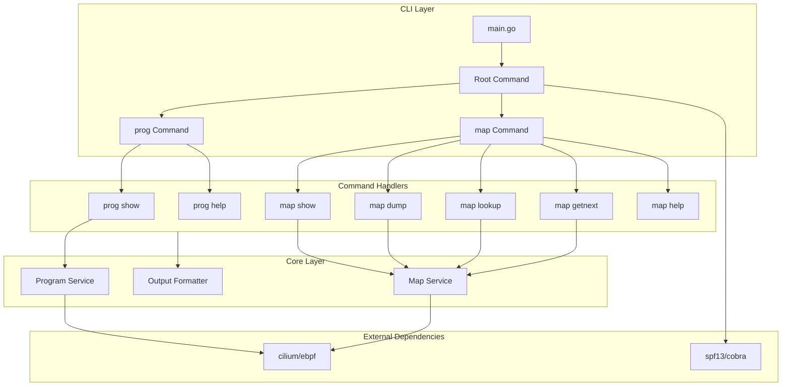

# Design Document: gobpftool

## Overview

gobpftool is a Go CLI tool for inspecting eBPF programs and maps, providing functionality similar to Linux's `bpftool`. It uses the [cilium/ebpf](https://github.com/cilium/ebpf) library to interact with the kernel's eBPF subsystem.

This initial implementation focuses on read-only operations:
- Program inspection: `prog show`, `prog help`
- Map read operations: `map show`, `map dump`, `map lookup`, `map getnext`, `map help`

## Architecture



## Components and Interfaces

### 1. CLI Layer (`cmd/`)

Uses [spf13/cobra](https://github.com/spf13/cobra) for command-line parsing.

#### Root Command (`cmd/root.go`)
```go
type GlobalFlags struct {
    JSON      bool   // -j, --json
    Pretty    bool   // -p, --pretty
}

var rootCmd = &cobra.Command{
    Use:   "gobpftool",
    Short: "Tool for inspection of eBPF programs and maps",
}
```

#### Program Commands (`cmd/prog.go`)
```go
var progCmd = &cobra.Command{
    Use:   "prog",
    Short: "Inspect eBPF programs",
}

var progShowCmd = &cobra.Command{
    Use:     "show [PROG]",
    Aliases: []string{"list"},
    Short:   "Show information about loaded programs",
}

var progHelpCmd = &cobra.Command{
    Use:   "help",
    Short: "Display help for prog commands",
}
```

#### Map Commands (`cmd/map.go`)
```go
var mapCmd = &cobra.Command{
    Use:   "map",
    Short: "Inspect and read eBPF maps",
}

var mapShowCmd = &cobra.Command{
    Use:     "show [MAP]",
    Aliases: []string{"list"},
    Short:   "Show information about loaded maps",
}

var mapDumpCmd = &cobra.Command{
    Use:   "dump MAP",
    Short: "Dump all entries in a map",
}

var mapLookupCmd = &cobra.Command{
    Use:   "lookup MAP key KEY_DATA",
    Short: "Lookup key in the map",
}

var mapGetNextCmd = &cobra.Command{
    Use:   "getnext MAP [key KEY_DATA]",
    Short: "Get next key in the map",
}

var mapHelpCmd = &cobra.Command{
    Use:   "help",
    Short: "Display help for map commands",
}
```

### 2. Core Layer (`pkg/`)

#### Program Service (`pkg/prog/service.go`)
```go
package prog

import "github.com/cilium/ebpf"

type ProgramInfo struct {
    ID         uint32
    Type       string
    Name       string
    Tag        string
    GPL        bool
    LoadedAt   time.Time
    UID        uint32
    BytesXlat  uint32
    BytesJIT   uint32
    MemLock    uint32
    MapIDs     []uint32
}

type Service interface {
    // List returns all loaded eBPF programs
    List() ([]ProgramInfo, error)
    
    // GetByID returns program info by ID
    GetByID(id uint32) (*ProgramInfo, error)
    
    // GetByTag returns programs matching the tag
    GetByTag(tag string) ([]ProgramInfo, error)
    
    // GetByName returns programs matching the name
    GetByName(name string) ([]ProgramInfo, error)
    
    // GetByPinnedPath returns program at the pinned path
    GetByPinnedPath(path string) (*ProgramInfo, error)
}
```

#### Map Service (`pkg/maps/service.go`)
```go
package maps

import "github.com/cilium/ebpf"

type MapInfo struct {
    ID         uint32
    Type       string
    Name       string
    KeySize    uint32
    ValueSize  uint32
    MaxEntries uint32
    Flags      uint32
    MemLock    uint32
}

type MapEntry struct {
    Key   []byte
    Value []byte
}

type Service interface {
    // List returns all loaded eBPF maps
    List() ([]MapInfo, error)
    
    // GetByID returns map info by ID
    GetByID(id uint32) (*MapInfo, error)
    
    // GetByName returns maps matching the name
    GetByName(name string) ([]MapInfo, error)
    
    // GetByPinnedPath returns map at the pinned path
    GetByPinnedPath(path string) (*MapInfo, error)
    
    // Dump returns all entries in the map
    Dump(id uint32) ([]MapEntry, error)
    
    // Lookup returns the value for a key
    Lookup(id uint32, key []byte) ([]byte, error)
    
    // GetNextKey returns the next key after the given key
    // If key is nil, returns the first key
    GetNextKey(id uint32, key []byte) ([]byte, error)
}
```

#### Output Formatter (`pkg/output/formatter.go`)
```go
package output

type Format int

const (
    FormatPlain Format = iota
    FormatJSON
    FormatJSONPretty
)

type Formatter interface {
    // FormatPrograms formats program info for output
    FormatPrograms(progs []prog.ProgramInfo) string
    
    // FormatMaps formats map info for output
    FormatMaps(maps []maps.MapInfo) string
    
    // FormatMapEntries formats map entries for output
    FormatMapEntries(entries []maps.MapEntry, keySize, valueSize uint32) string
    
    // FormatMapEntry formats a single map entry
    FormatMapEntry(entry maps.MapEntry, keySize, valueSize uint32) string
    
    // FormatNextKey formats the next key result
    FormatNextKey(currentKey, nextKey []byte) string
    
    // FormatError formats an error message
    FormatError(err error) string
}

func NewFormatter(format Format) Formatter
```

### 3. Project Structure

```
gobpftool/
├── main.go                 # Entry point
├── go.mod
├── go.sum
├── cmd/
│   ├── root.go            # Root command and global flags
│   ├── prog.go            # prog subcommand and handlers
│   ├── map.go             # map subcommand and handlers
│   └── version.go         # version command
├── pkg/
│   ├── prog/
│   │   ├── service.go     # Program service interface
│   │   └── service_impl.go # Implementation using cilium/ebpf
│   ├── maps/
│   │   ├── service.go     # Map service interface
│   │   └── service_impl.go # Implementation using cilium/ebpf
│   └── output/
│       ├── formatter.go   # Output formatter interface
│       ├── plain.go       # Plain text formatter
│       └── json.go        # JSON formatter
└── internal/
    └── utils/
        └── hex.go         # Hex parsing utilities
```

## Data Models

### Program Identifier
Programs can be identified by:
- `id <ID>` - Numeric program ID
- `tag <TAG>` - 8-byte program tag (hex string)
- `name <NAME>` - Program name
- `pinned <PATH>` - Path in BPF filesystem

### Map Identifier
Maps can be identified by:
- `id <ID>` - Numeric map ID
- `name <NAME>` - Map name
- `pinned <PATH>` - Path in BPF filesystem

### Key/Value Data Format
Key and value data are specified as space-separated hex bytes:
```
key 0a 0b 0c 0d
value 01 02 03 04 05 06 07 08
```

## Error Handling

### Error Types
```go
package errors

var (
    ErrNotFound        = errors.New("not found")
    ErrPermission      = errors.New("permission denied: requires CAP_SYS_ADMIN or CAP_BPF")
    ErrBpfFSNotMounted = errors.New("BPF filesystem not mounted at /sys/fs/bpf")
    ErrInvalidID       = errors.New("invalid ID")
    ErrInvalidKey      = errors.New("invalid key format")
    ErrKeyNotFound     = errors.New("key not found in map")
    ErrNoMoreKeys      = errors.New("no more keys")
)
```

### Error Handling Strategy
1. All errors are written to stderr
2. Successful operations return exit code 0
3. Failed operations return exit code 1
4. Permission errors include guidance on required capabilities
5. BPF filesystem errors include mount instructions

## Testing Strategy

### Unit Tests
- Test output formatters with mock data
- Test hex parsing utilities
- Test command argument parsing

### Integration Tests
- Test against real eBPF programs/maps (requires root)
- Use test fixtures with known eBPF programs
- Verify output format matches bpftool

### Test Structure
```
gobpftool/
├── pkg/
│   ├── prog/
│   │   └── service_test.go
│   ├── maps/
│   │   └── service_test.go
│   └── output/
│       ├── plain_test.go
│       └── json_test.go
└── internal/
    └── utils/
        └── hex_test.go
```

## Dependencies

| Package | Purpose |
|---------|---------|
| `github.com/cilium/ebpf` | eBPF program and map interaction |
| `github.com/spf13/cobra` | CLI framework |
| `encoding/json` | JSON output formatting |

## Output Format Examples

### prog show (plain text)
```
185: sched_cls  name my_prog  tag f0055c08993fea1e  gpl
        loaded_at 2025-11-24T05:50:46+0000  uid 0
        xlated 5200B  jited 3263B  memlock 8192B  map_ids 85,39,38,83,84
```

### prog show (JSON)
```json
{
  "programs": [
    {
      "id": 185,
      "type": "sched_cls",
      "name": "my_prog",
      "tag": "f0055c08993fea1e",
      "gpl_compatible": true,
      "loaded_at": "2025-11-24T05:50:46+0000",
      "uid": 0,
      "bytes_xlated": 5200,
      "bytes_jited": 3263,
      "bytes_memlock": 8192,
      "map_ids": [85, 39, 38, 83, 84]
    }
  ]
}
```

### map show (plain text)
```
10: hash  name some_map  flags 0x0
        key 4B  value 8B  max_entries 2048  memlock 167936B
```

### map dump (plain text)
```
key: 00 01 02 03  value: 00 01 02 03 04 05 06 07
key: 0d 00 07 00  value: 02 00 00 00 01 02 03 04
Found 2 elements
```

### map lookup (plain text)
```
key: 00 01 02 03 value: 00 01 02 03 04 05 06 07
```

### map getnext (plain text)
```
key:
00 01 02 03
next key:
0d 00 07 00
```
